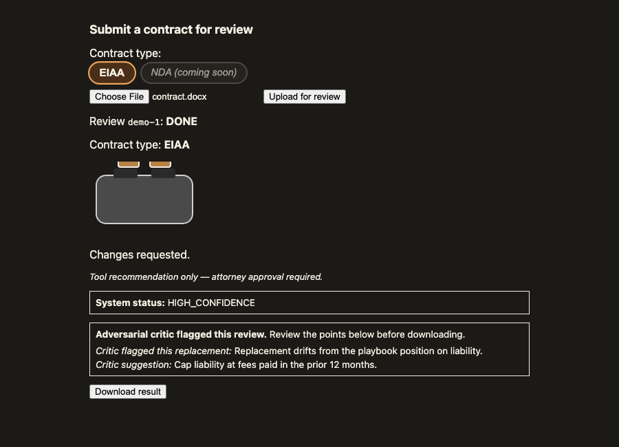

# contract-toaster

An open-source tool for reviewing **Educational Affiliation Agreements for Student Internships** (EIAA) submitted by partner educational institutions, against Exos's standard positions.

A reviewer uploads a counterparty-modified draft; an LLM applies the codified Exos playbook and produces either an ACCEPT decision or a redlined `.docx` with tracked changes and footnoted rationales for each requested change.

> **Reviewing this repo?** Start with **[docs/REVIEW-GUIDE.md](docs/REVIEW-GUIDE.md)** — an honest orientation to what actually works today (the review pipeline is currently a mock), the two deployment targets (AWS and a self-contained Docker/DTS stack), how to see it running, and the roadmap.



## Status

In active development. Not yet deployed. See [milestones](https://github.com/contract-opf/contract-toaster/milestones) for phase progress.

RUNBOOK.md and ARCHITECTURE.md describe the target design, some of it ahead of
the code — that's a deliberate "docs as spec" choice for a solo team, but it
means the docs alone don't tell you what's reachable today. See
[docs/implementation-status.md](docs/implementation-status.md) for the
SHIPPED / STUBBED / PLANNED ledger of every admin-UI capability and
observability surface RUNBOOK.md describes.

## What this does

1. Reviewer signs in via Google SSO (restricted to `teamexos.com`).
2. Reviewer uploads a counterparty `.docx`.
3. Service compares it against our standard form and the current EIAA playbook.
4. Service returns either:
   - **ACCEPT** — counterparty's changes are within our acceptable range; no redline required.
   - **REQUEST_CHANGE** — a redlined `.docx` with tracked changes and footnoted rationales for each material edit.
5. Every review is logged with the playbook version, model, token counts, and cost.

A human attorney reviews and approves before anything goes back to the school. This tool produces drafts and analysis; it does not give legal advice and does not constitute approval. Every output is a **tool recommendation only; attorney approval required** — an ACCEPT means "no requested changes identified by the tool", not "no action needed".

## What this is not

- Not a replacement for attorney judgment.
- Not connected to any counterparty system.
- Not training a model on Exos documents. We use Anthropic Claude via Amazon Bedrock; per Bedrock terms, prompts and outputs are not used to train models.

## Architecture, in brief

- **Frontend.** React SPA on AWS Amplify Hosting. Cognito user pool federated to Google as the only IdP, hosted-domain restricted.
- **Backend.** Python (FastAPI) container on AWS App Runner serving the API only. Builds go through CI (CodeBuild or equivalent): tests and scans run, a signed container image is pushed to ECR, and App Runner is pinned to an immutable image **digest** that is promoted deliberately. A merge to `main` never auto-mutates production legal behavior.
- **Review pipeline.** Reviews run asynchronously: the API starts an AWS Step Functions execution **directly** (extract → retrieve → primary review → adversarial review → leakage scan → redline → persist), and the UI polls for the result. There is no SQS buffer on the entry path. Idempotency comes from a submission record, one spend reservation per `review_id`, deterministic Step Functions execution names, and retry-safe "ensure execution started" semantics.
- **LLM.** Anthropic Claude via Amazon Bedrock (single-region, `us-east-1`, native model ID — no cross-region inference profile), in a two-pass (reviewer + adversarial critic) design. The model is governed by an explicit model-policy matrix: primary model, critic model, embedding model, optional fallback, region, request contract, evaluation run, and cost assumptions. v1 pins **Opus 4.8 as the primary reviewer and a *different* model (Sonnet 4.6) as the adversarial critic** — a different critic decorrelates the two passes' blind spots and costs less — unless a future evaluated policy says otherwise.
- **Retrieval.** Hybrid lexical + semantic retrieval over the executed-agreements corpus: an Amazon Bedrock Knowledge Base (backed by S3 Vectors) supplies semantic recall, paired with deterministic keyword/rule detectors for hard-rejection terms that semantic search can miss.
- **Corpus governance.** Corpus ingestion creates a draft snapshot. Only a curated, regression-tested snapshot can become active, and every review records the corpus snapshot it used.
- **Storage.** S3 (uploads, redlines, corpus, audit; governance object lock on corpus and audit; admin-configurable document retention plus storage-level legal hold). DynamoDB (users, playbooks, playbook versions, reviews, audit log, cost ledger). Immutable audit rows contain only non-substantive audit facts; model rationales and critic deltas live only in retention-governed confidential storage.
- **Infrastructure as code.** AWS CDK (TypeScript). Everything is `cdk deploy`.
- **Redlining.** `scripts/redline_docx_writer.py` is a small, dependency-free OOXML tracked-changes writer we own outright, built entirely on the Python standard library (`zipfile` + `xml.etree.ElementTree`). There is no vendored `anthropics/skills` `docx` fork and no `backend/vendor/` directory in this repo; see [ARCHITECTURE.md → Redlining](ARCHITECTURE.md#redlining--owned-docx-library).
- **Review prompt and playbook structure.** Prompts are assembled in code by `scripts/primary_review_pass.py` (system prompt = review guidance + binary-decision overlay + playbook JSON, per a fixed manifest), not stored as a `prompts/` directory. The review guidance was informed by [`anthropics/claude-for-legal`](https://github.com/anthropics/claude-for-legal)'s `contract-review` skill as reference material, with our own overlay for the binary-decision output format. Active releases are a governed bundle: playbook hash, prompt hash, standard-form hash, model-policy hash, corpus snapshot, evaluation run, and Legal approval. Precedent citations are internal-only; generated external footnotes cite the contract position, not prior counterparties.

See [ARCHITECTURE.md](ARCHITECTURE.md) for the full picture. The supplemental issue register in [docs/architecture-issue-spotting-2026-06-01.md](docs/architecture-issue-spotting-2026-06-01.md) records the latest design review findings that shaped the current docs.

## Repository layout

```
contract-toaster/
├── README.md
├── ARCHITECTURE.md
├── RUNBOOK.md
├── LICENSE
├── playbooks/
│   ├── schema.json              # generalizable playbook schema
│   └── eiaa-v1.0.0.json         # current EIAA playbook
├── standard-forms/              # canonical standard-form .docx files and derived anchor maps
│   ├── README.md                # directory guide and build instructions
│   ├── eiaa-v1.0.0.SYNTHETIC.docx  # synthetic placeholder standard form (real GC-supplied form pending; see standard-forms/README.md)
│   └── eiaa-v1.0.0.anchor-map.json  # versioned, hashed anchor map (incl. §10 sub-clause splits)
├── scripts/                     # the review pipeline: pure, tested modules (no separate prompts/ or vendor/ tree)
│   ├── docs-lint.py             # documentation lint
│   ├── build_anchor_map.py      # anchor-map builder: docx → anchor map artifact
│   ├── primary_review_pass.py   # prompt assembly + primary review pass (code-assembled, not a prompts/ directory)
│   └── redline_docx_writer.py   # dependency-free OOXML tracked-changes writer we own outright
├── infra/                       # AWS CDK (TypeScript)
├── backend/                     # Python service for App Runner + pipeline tasks
│   ├── Dockerfile
│   ├── requirements.txt
│   └── src/
├── frontend/                    # React SPA for Amplify
└── docs/
```

## Documentation source of truth

The source docs are this README, [ARCHITECTURE.md](ARCHITECTURE.md), [RUNBOOK.md](RUNBOOK.md), and the files under [docs/](docs/). Generated review packets are not authoritative; regenerate them from these files if needed.

## Local development

The fastest way to see the app running is the self-contained DTS (Docker
Compose) stack — no AWS account required:

```bash
gh repo clone contract-opf/contract-toaster
cd contract-toaster
cp deploy/dts/.env.example deploy/dts/.env      # set DEMO_TOKEN_SECRET
docker compose -f deploy/dts/docker-compose.yml --env-file deploy/dts/.env up --build
```

- SPA: <http://localhost:8081> — sign in with **admin/admin** or **user/user**
- API: <http://localhost:8080>

Full instructions, what's mocked, and what to expect are in
[docs/REVIEW-GUIDE.md](docs/REVIEW-GUIDE.md) and
[deploy/dts/README.md](deploy/dts/README.md).

## Deploying to AWS

This repo is a work in progress; the AWS deployment (App Runner, Amplify
Hosting, Cognito, Step Functions) is not yet reachable end-to-end from a
fresh clone — see [docs/REVIEW-GUIDE.md](docs/REVIEW-GUIDE.md) for the
current status and blocking issues.

```bash
# Prerequisites
brew install node awscli gh
npm install -g aws-cdk

# Infrastructure (CDK)
cd infra
npm install
cdk synth                        # validate
cdk diff                         # preview changes
cdk deploy                       # deploy

# Backend (run locally against deployed AWS resources)
cd ../backend
python -m venv .venv && source .venv/bin/activate
pip install -r requirements.txt
uvicorn src.main:app --reload

# Frontend (run locally against deployed Cognito)
cd ../frontend
npm install
npm run dev
```

Full setup details live in [RUNBOOK.md](RUNBOOK.md).

## Contributing

- All work is tracked in GitHub issues, grouped by phase milestone.
- Every change goes through a pull request. `main` is protected.
- Anything that modifies `playbooks/` or `prompts/` requires legal review (enforced by CODEOWNERS).
- Conventional commits: `feat:`, `fix:`, `chore:`, `docs:`, `refactor:`, `test:`.
- Branch naming: `phase-N/short-description` (e.g., `phase-0/cognito-google-idp`).

## About

This repository is published by Exos as an open-source reference implementation, including the codified EIAA playbook and negotiation positions. It is provided as-is under the Apache-2.0 license; it is not legal advice, and every output is a tool recommendation only — attorney approval required.

## Owners

- **Product and legal review:** Exos General Counsel
- **Engineering:** see CODEOWNERS

## License

Apache License 2.0. See [LICENSE](LICENSE).
